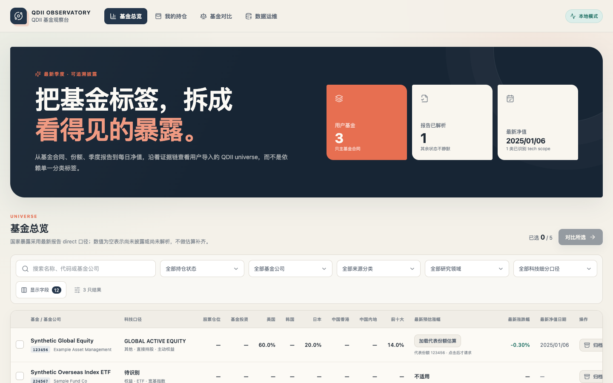

# QDII Observatory（QDII 基金观察台）

一个面向中国内地 QDII 基金的本地优先研究工作台。它把基金清单、正式季报、每日净值、场内价格、申购限额和穿透结果放进同一条可追溯证据链。



> 截图使用仓库内的 synthetic demo，不代表任何真实基金、账户或持仓。

## 能做什么

- 按基金公司、来源分类、研究领域或六位代码，从公开信息添加自选基金。
- 归档原始报告与来源链接，解析国家、行业、股票和基金持仓，并保留质量问题。
- 分开保存官方净值、场内价格、申购限额和汇率，支持基金详情与多基金对比。
- 可选启用本地持仓、定投确认和披露持仓一致性分析；默认不连接账户、不自动交易。

项目不生成买卖指令，公开数据可能延迟或不完整，所有输出仅用于研究，不构成投资建议。详见 [免责声明](DISCLAIMER.md)。

## 5 分钟启动

需要 Git、Docker Engine（或 Docker Desktop）和 Docker Compose v2。

```bash
git clone <your-fork-or-local-repository-url> qdii-observatory
cd qdii-observatory
cp .env.example .env
# 修改 .env 中的示例数据库密码
docker compose up --build
```

打开 <http://127.0.0.1:5173>。API 文档位于 <http://127.0.0.1:8000/api/docs>，就绪检查位于 <http://127.0.0.1:8000/ready>。

第一次使用建议按下面的顺序：

1. 在“数据运维”中从公开信息选择基金，或输入六位基金代码。
2. 为新基金运行“按本季度补齐全部阶段”。
3. 在“基金总览”查看覆盖，在基金详情和“基金对比”查看暴露与净值。
4. 如需个人持仓，显式设置 `QDII_ENABLE_PORTFOLIO=true` 后重启，再通过 XLSX 预览确认或手动录入。

逐页操作、状态解释和常见问题见 [用户指南](docs/user-guide.md)。外部 PostgreSQL、自动建库授权和冲突库保护见 [外部 PostgreSQL](docs/external-postgresql.md)。

## 数据与隐私边界

- 第三方原始数据默认只保存在本地 `.data/`，不随代码仓库分发。
- “我的持仓”入口可见，但数据能力默认关闭；启用后也不会连接券商或自动上传文件。
- 不要提交 `.env`、数据库、备份、真实持仓、Provider 原始响应、cookie、token 或本地覆盖配置。
- Issue、日志和截图也应只使用 synthetic 数据。公开发布前请执行 [发布清单](PUBLIC_RELEASE_CHECKLIST.md)。

数据来源、许可和 Provider 边界见 [DATA_SOURCES.md](DATA_SOURCES.md) 与 [DATA_LICENSE.md](DATA_LICENSE.md)。

## 本地开发

宿主机开发需要 Python 3.12+、Node.js 22.22+ 和 pnpm 11；Docker 启动不需要这些宿主机运行时。

```bash
python3 -m venv .venv
.venv/bin/pip install -e '.[dev]'
corepack enable
cd frontend && pnpm install --frozen-lockfile && cd ..
make dev-backend       # 终端 1
make dev-frontend      # 终端 2
make check
```

## 文档

- 上手与运维：[用户指南](docs/user-guide.md) · [快速开始](docs/quickstart.md) · [每日维护与重启](docs/daily-operations.md) · [故障排查](docs/troubleshooting.md)
- 部署与设计：[配置](docs/configuration.md) · [外部 PostgreSQL](docs/external-postgresql.md) · [架构](docs/architecture.md) · [数据模型](docs/data-model.md)
- 研究方法：[报告解析](docs/report-parsing.md) · [穿透](docs/lookthrough.md) · [披露持仓一致性](docs/disclosed-holdings-analysis.md)
- 项目治理：[贡献指南](CONTRIBUTING.md) · [隐私](PRIVACY.md) · [安全](SECURITY.md) · [变更记录](CHANGELOG.md) · [路线图](ROADMAP.md)

## License

代码采用 Apache License 2.0。第三方数据、报告、接口响应与 PDF 不自动受该许可证覆盖。
