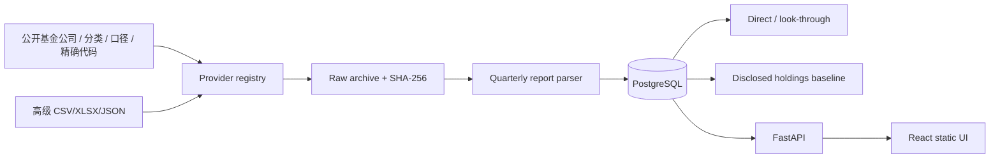

# 架构

QDII Observatory 是单用户、本地优先的模块化单体：PostgreSQL 保存结构化事实，Python 进程承载 ingestion/parser/analysis/API，React 由 Nginx 静态托管。

依赖方向保持单向：Provider 只产生 provider-neutral record；archive 先保存来源证据；parser 不静默补 0；domain model 不依赖站点字段。研究查询 API 保持只读，只有显式基金选择使用本地 POST 导入端点。Portfolio 路由、CLI 和 UI 由同一环境开关控制。

核心表覆盖基金合同/份额、报告及解析行、来源 artifact、基金关系、daily NAV、exchange price、质量问题和 ingestion run。NAV 与场内价格分表，避免把溢价当净值收益。
